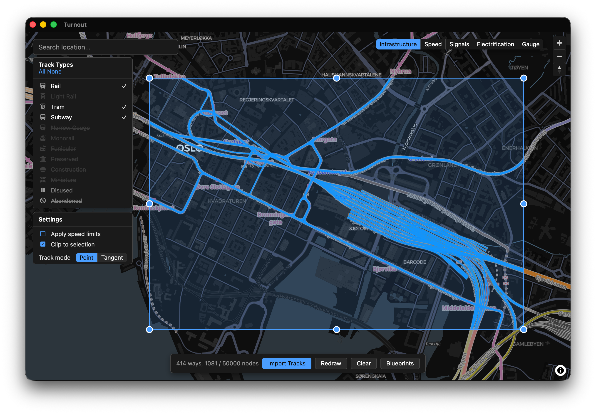

<p align="center">
  
</p>

<h1 align="center">Turnout</h1>

<p align="center">
  Import real-world railway tracks from <a href="https://www.openrailwaymap.org/">OpenRailwayMap</a> into <a href="https://store.steampowered.com/app/1134710/NIMBY_Rails/">Nimby Rails</a> blueprints.
</p>

<p align="center">
  <a href="https://github.com/SuperManifolds/Turnout/releases"><strong>Download the latest release</strong></a>
</p>



## Install

### macOS

[DMG (Apple Silicon)](https://github.com/SuperManifolds/Turnout/releases/latest/download/Turnout_aarch64.dmg) · [DMG (Intel)](https://github.com/SuperManifolds/Turnout/releases/latest/download/Turnout_x86_64.dmg)

### Windows

[EXE Installer](https://github.com/SuperManifolds/Turnout/releases/latest/download/Turnout_x64_setup.exe) · [MSI](https://github.com/SuperManifolds/Turnout/releases/latest/download/Turnout_x64.msi)

### Linux

[AppImage (x86)](https://github.com/SuperManifolds/Turnout/releases/latest/download/Turnout_amd64.AppImage) · [AppImage (ARM64)](https://github.com/SuperManifolds/Turnout/releases/latest/download/Turnout_aarch64.AppImage) · [DEB (x86)](https://github.com/SuperManifolds/Turnout/releases/latest/download/Turnout_amd64.deb) · [DEB (ARM64)](https://github.com/SuperManifolds/Turnout/releases/latest/download/Turnout_aarch64.deb)

For AppImage: `chmod +x Turnout_amd64.AppImage` then run it. Or install the `.deb` package instead.

## Building

```bash
# Prerequisites: Rust, Trunk, wasm32 target, Tauri CLI
cargo install --locked trunk
cargo install tauri-cli
rustup target add wasm32-unknown-unknown

# Development
cargo tauri dev

# Release build
cargo tauri build
```

## Contributing

See [CONTRIBUTING.md](CONTRIBUTING.md) for guidelines.

## License

[MIT](LICENSE)
